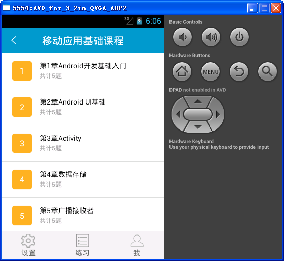

# 简介
这是一个原生java实现的入门级别的android应用，取名为课堂小助手

> 详情请查看sourceHelp.doc文件，里面有项目结构以及代码功能介绍

# 实现功能
* 基本的用户登录，注册，退出
* 忘记密码
* 设置密保
* 添加和修改个人信息
* 课程信息界面的展示

# 所需资源
* gson-2.6.2.jar
> 处理json数据使用

# 屏幕截图

     

## 结语
    

通过这个小项目使我对于android开发不再陌生，希望对于刚入门的你也有所帮助，欢迎issues！！！
